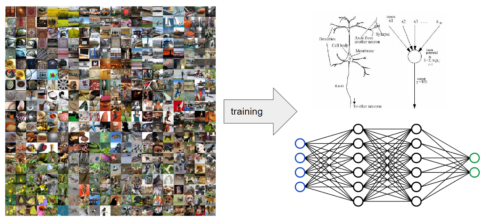
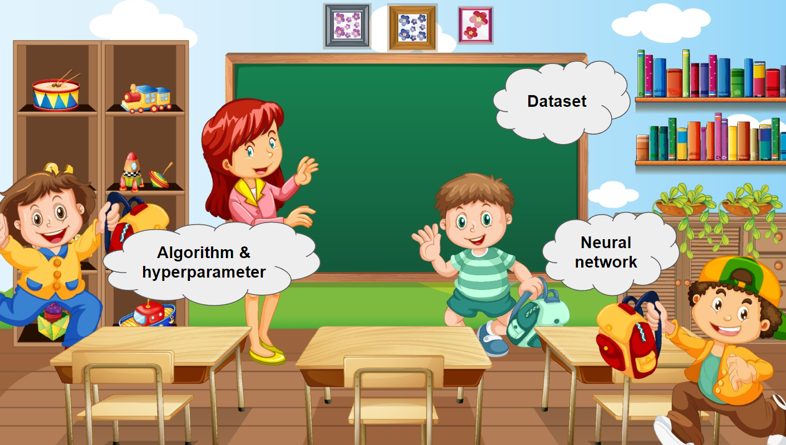

# summer_2024

# 영재학교 현장연구 2024년도

## The Artificial Intelligence

### What is Artificial Intelligence?
Artificial Intelligence (AI) is a branch of computer science that focuses on creating machines or software that can perform tasks that usually require human intelligence. These tasks include understanding language, recognizing patterns, making decisions, and learning from experience.

### How Does AI Work?
AI works by using a lot of data and advanced algorithms (which are like recipes for solving problems) to learn and make decisions. There are a few key components that make AI work:

- Data: AI needs a lot of data to learn from. This could be anything from text, images, and videos to numbers and statistics.
- Algorithms: These are the step-by-step instructions that tell the AI how to analyze the data and learn from it.
- Machine Learning: This is a type of AI where the computer is given lots of data and it learns patterns and rules from that data. The more data it gets, the better it becomes at understanding and predicting new information.
- Neural Networks: These are complex algorithms inspired by the human brain that help AI systems recognize patterns and make decisions.

### AI in Data Management Projects
For your data management projects, AI can be used in several cool ways:

- Data Sorting: AI can quickly sort through large amounts of data and organize it in a meaningful way.
- Pattern Recognition: AI can find patterns in data that humans might miss. For example, it can analyze customer purchase data to find trends.
- Predictive Analysis: AI can use past data to make predictions about future trends. This is useful for forecasting sales, predicting equipment failures, or even suggesting what books you might like to read next.
- Automation: AI can automate repetitive tasks, freeing up time for more important work. For example, it can automatically clean and prepare data for analysis.
Examples of AI You Might Know
- Siri and Alexa: These virtual assistants use AI to understand your voice commands and respond to them.
Recommendation Systems: Websites like Netflix or YouTube use AI to recommend shows or videos you might like based on what you've watched before.
- Self-Driving Cars: Companies like Tesla use AI to help cars drive themselves by recognizing road signs, other cars, and obstacles.
Why is AI Important?

AI is important because it can handle complex tasks quickly and accurately, often better than humans. This can lead to more efficient processes, new insights, and innovative solutions to problems.

### How Can You Learn More About AI?
- Online Courses: Websites like Coursera and Khan Academy offer introductory courses on AI and machine learning.
- Programming: Learning to code in languages like Python can help you understand how AI algorithms work.
- Projects: Hands-on projects, like the ones you're doing, are a great way to learn. Try building simple AI models to see how they work.

Remember, AI is all about making machines smart so they can help us with various tasks. Whether it's managing data, recognizing patterns, or predicting future events, AI is a powerful tool that can make our lives easier and more efficient.

## Object detection as an example

### What is the object detection?
Imagine you have a photo with a lot of different things in it: a dog, a cat, a tree, and a car. Object detection is a way for computers to look at that photo and not only recognize what's in it but also point out exactly where each thing is. It's like having a super-smart computer that can see and tell you, "Here's a cat, there's a dog, and over there is a car."

### How Does It Work?
- Understanding Images: Just like our eyes send signals to our brain when we see something, computers use images made of tiny dots called pixels. These pixels have different colors and brightness, which help the computer understand what's in the picture.

- Learning from Examples: To teach a computer to recognize and locate objects, we show it thousands of examples. For instance, if we want it to detect cats, we give it many photos of cats and tell it, "This is a cat." Over time, it learns what a cat looks like.

- Deep Learning: This is a special type of machine learning where the computer uses a neural network – a series of algorithms that mimic the human brain. The neural network has many layers, each helping to recognize different parts of an object, like the shape of a cat's ears or the pattern of its fur.

- Bounding Boxes: Once the computer learns to recognize objects, it can draw rectangles (bounding boxes) around them in new photos. So, when it sees a new picture with a cat and a dog, it can say, "Here’s the cat!" and "There’s the dog!" with boxes around them.

### Why is Object Detection Useful?
- Safety: In self-driving cars, object detection helps the car understand its surroundings, recognizing pedestrians, other cars, and traffic signs to drive safely.
- Healthcare: In medicine, it can help doctors identify problems in X-rays or MRIs.
- Fun and Convenience: Apps on your phone, like those that automatically tag your friends in photos or help you shop by recognizing items, use object detection.

### Getting Started
To start a project in object detection, you'll need:

- Data: Lots of labeled images (photos where the objects are already identified and marked).
- Tools: A computer with the necessary software, such as Python and libraries like TensorFlow or PyTorch.
- Models: Pre-trained models (like YOLO, SSD, or Faster R-CNN) which can save you time because they've already learned to detect many objects.
Conclusion

Object detection is a fascinating field that blends technology and creativity. It allows computers to see and understand the world in ways that can help make our lives easier, safer, and more fun. By starting a project in object detection, you're stepping into the future of technology!

## Introduction to Arduino

### What is Arduino?

Arduino is an open-source electronics platform based on easy-to-use hardware and software. It's designed to make the process of using electronics in multidisciplinary projects more accessible. The Arduino boards are equipped with a microcontroller, which is a small computer on a single integrated circuit.

### Why Use Arduino?
- Educational Tool: Arduino is widely used in educational environments because it simplifies the process of learning electronics and programming.
Creativity and Innovation: It allows users to create interactive projects by connecting various sensors, actuators, and other components.
- Community Support: There is a large community of users who share their projects and solutions, making it easier to find help and inspiration.
Key Components of Arduino
- Arduino Board: The physical board that you program. Popular models include Arduino Uno, Nano, and Mega.
- Microcontroller: The 'brain' of the Arduino, which executes the code you write.
- Digital and Analog Pins: These are used to connect sensors, LEDs, motors, and other components.
- USB Connection: Used for uploading programs from your computer to the board.
- Power Supply: Arduino can be powered via USB or an external power source.

## Getting Started with Arduino

### Set Up Your Arduino:
- Install the Arduino IDE: Download and install the Arduino Integrated Development Environment (IDE) from arduino.cc.
- Connect the Board: Use a USB cable to connect your Arduino board to your computer.

### Sensors and Actuators:
- Sensors: Devices that detect changes in the environment, such as temperature sensors, light sensors, and motion sensors.
- Actuators: Devices that perform actions, such as LEDs, motors, and buzzers.

### Building Projects:
Start with simple projects like blinking LEDs, reading a button press, or measuring temperature.
Gradually move to more complex projects like creating a weather station, a robotic arm, or an automated plant watering system.

### Resources
- Arduino Website: Arduino.cc for official documentation, tutorials, and project ideas.
- Community Forums: Places like the Arduino Forum and Instructables where you can ask questions and share your projects.
- YouTube Channels: Many creators share Arduino tutorials and project walkthroughs.

## How to use ESP32

### What is ESP32

The ESP32 is a low-cost, low-power system on a chip (SoC) with integrated Wi-Fi and Bluetooth capabilities. It is developed by Espressif Systems and is widely used in IoT (Internet of Things) applications due to its versatility and powerful features.

- ESP32 pinout map

### Why Use ESP32?
- Connectivity: Built-in Wi-Fi and Bluetooth make it easy to connect to networks and other devices.
Powerful Processing: It has dual-core processing power, which is much stronger than many other microcontrollers.
- Versatility: Suitable for a wide range of applications, from simple projects to complex IoT solutions.
- Cost-Effective: Offers a lot of features at a relatively low price.
Key Features of ESP32
- Wi-Fi and Bluetooth: Allows wireless communication with other devices and networks.
- Dual-Core Processor: Ensures efficient handling of multiple tasks.
- GPIO Pins: General-purpose input/output pins for connecting sensors, actuators, and other components.
- Analog and Digital Inputs: Capable of reading both analog and digital signals.
- Built-in Sensors: Some models come with integrated sensors like touch and Hall effect sensors.